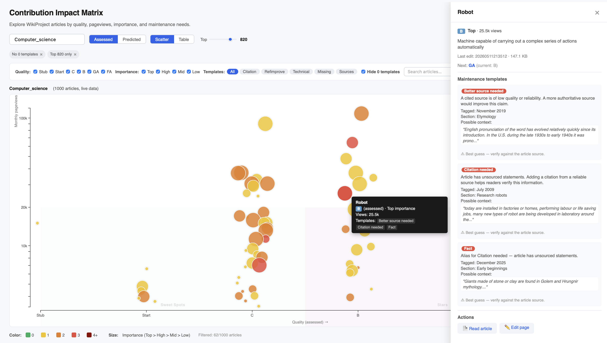
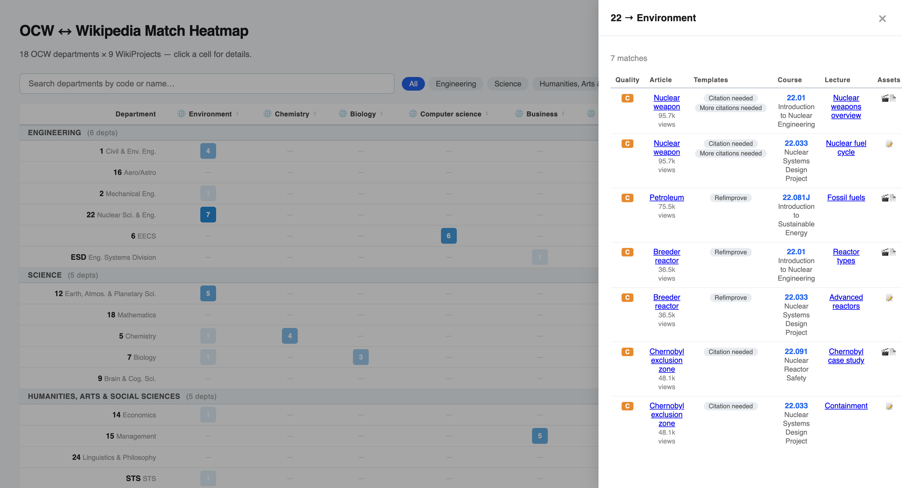

# MIT OCW LLM Wiki

A living, interlinked knowledge base of MIT OpenCourseWare's 2,500+ courses,
built incrementally by an LLM agent following the [LLM Wiki
pattern](https://gist.github.com/karpathy/442a6bf555914893e9891c11519de94f).

Courses are ingested from the [MIT Learn API](https://api.learn.mit.edu) and
cross-referenced against Wikipedia to identify where MIT's open-licensed
educational materials can improve articles. The wiki is maintained as markdown
files and compiled into a browsable site by the WikiWise app.

This repository also contains two interactive data visualization tools that
demonstrate what becomes possible once course metadata is normalized and
cross-referenced against Wikipedia:

- **Contribution Impact Matrix** ([`v0.1-impact-matrix`]) — a D3.js bubble
  scatterplot that surfaces high-impact articles to improve within any
  WikiProject. Uses pre-computed pageviews, quality ratings, importance, and
  maintenance template data. Self-contained HTML, works from `file://`.

- **OCW ↔ Wikipedia Match Heatmap** ([`v0.1-heatmap`]) — a cross-reference
  matrix showing where OCW course content overlaps with Wikipedia WikiProject
  article scopes. 18 OCW departments × 9 WikiProjects, with clickable cells
  for match details.

[`v0.1-impact-matrix`]: https://github.com/fuzheado/mit-ocw-wiki/releases/tag/v0.1-impact-matrix
[`v0.1-heatmap`]: https://github.com/fuzheado/mit-ocw-wiki/releases/tag/v0.1-heatmap

## Status

- **Courses discovered:** 2,577 (all ingested)
- **Courses asset-scanned:** ~2,500+ (hybrid scan)
- **Departments:** 37 | **Topics:** 110 | **Instructors:** 2,142
- **Stages:** Bootstrap (0-2) ✅ | Asset scan (3) ✅ | Wikipedia crossref (4) ✅ | Contribution Impact Matrix (4b) ✅ — v0.1 tagged

## What's built

| Layer | Status | Details |
|-------|--------|---------|
| Course ingest | ✅ | All 2,577 courses via batch API |
| Course pages | ✅ | YAML frontmatter with canonical metadata |
| Department/topic pages | ✅ | 37 depts, 110 topics with cross-links |
| Instructor index | ✅ | 2,142 instructors, A-Z grouped |
| Hybrid asset scan | ✅ | API + URL deep scan, merged with type correction |
| Video detection | ✅ | YouTube, OCW player, MP4, Dropbox, thumbnails |
| Grouped lecture format | ✅ | One line per lecture with inline format badges |
| Pre-commit hook | ✅ | Auto-rebuilds index on wiki changes |
| Wikipedia crossref strategy | ✅ | Three-tier matching, unified SQL query, scoring model |
| **OCW ↔ Wikipedia Match Heatmap** | ✅ **v0.1** | 9 WikiProjects × 18 OCW departments, interactive matrix |
| **Contribution Impact Matrix** | ✅ **v0.1** | D3.js bubble scatterplot — standalone HTML |
| **Detail panel with context** | ✅ | Pre-computed wikitext: section, date, sentence |
| **Popular pages pipeline** | ✅ | Identified method to determine most-popular pages per WikiProject that beats Wikimedia API rate limits — uses Community Tech bot's pre-compiled Popular pages tables via a single `action=parse` call per project instead of 1,000+ individual pageview API calls |

## Key features

### Contribution Impact Matrix

A D3.js bubble scatterplot for exploring any WikiProject's articles by quality, pageviews, importance, and maintenance templates. Located at `wiki/impact-matrix/standalone.html` (1.7 MB self-contained, works from `file://`).

The tool shows a visualization of a given WikiProject, using its "Popular pages" report as a basis. At a glance, users can see the distribution of articles based on quality, importance, and pageviews. The color coding of the article circle indicatesa how many maintenance templates are on the page, and provides critical context in a popup window.



**Core visualization:**
- **X axis:** Quality (Stub → FA, ordinal scale, dynamically collapses hidden classes)
- **Y axis:** Monthly pageviews (log scale, from WikiProject Popular pages)
- **Bubble size:** Importance (Top > High > Mid > Low)
- **Bubble color:** Template count (green=0, yellow=1, orange=2, red=3, maroon=4+)
- **Quadrant overlays:** Sweet Spots, Stars, Sleepers, Tail

**Filters:**
- Rank slider (inline in header bar, top 10-1000 articles)
- Quality checkboxes (Stub/Start/C/B/GA/FA — hidden classes removed from X axis)
- Importance checkboxes (Top/High/Mid/Low)
- Template type pills (Citation, Refimprove, Technical, Missing, Sources)
- "Hide 0 templates" toggle — isolate articles with maintenance tags
- Text search by article title
- Active filters shown as removable chips

**Interactions:**
- Hover: tooltip with title, quality, importance, views, templates
- Click: slide-out detail panel with:
  - Short description (from Wikidata), last edit date, page size
  - Quality gap indicator ("Next: B, current: C")
  - Maintenance template cards with explanations
  - Per-template context: section name, date parameter, preceding sentence
  - 6 context classifiers (inline, infobox, table, footnote, blockquote, minimal)
  - Action links: "Read article", "Edit page" (direct to source editor)
- Scatter/Table view toggle (sortable columns)
- Assessed / Predicted quality toggle (mocked ORES)
- School group headers (Engineering, Science, Humanities, etc.)

**Data pipeline:**
- 8 WikiProjects × 500-1000 articles each (6,500 total)
- Popular pages fetched via `action=parse` (1 API call per project, 0 per article)
- Templates from SQL (`enwiki_p` via SSH tunnel) — 27 aliases including talk-page templates
- Wikitext context pre-computed with `mwparserfromhell` (section name, date, sentence)
- Short descriptions and page metadata from SQL batch queries
- All data pre-generated; no API calls needed at runtime

### Pageview data: key finding

The `enwiki_p` analytics replica does not contain pageview data (`page_props.pageview_daily_average` has 0 rows). The Wikimedia REST API was initially rate-limiting our early tests (~15 req/min) before we standardized on a compliant User-Agent string. With the proper UA (`MIT OCW Bot/1.0 (https://meta.wikimedia.org/wiki/Wiki_MIT; andrew.lih@gmail.com) ContentGapResearch`), rate limits are more lenient. However, Popular pages remain the preferred source — one API call returns 1,000 articles with views, quality, and importance vs. 1,000+ individual API calls for the same data. See `notes/pageview-data-issues.md` for details.

### Template context extraction

Maintenance template context (section name, date parameter, preceding sentence) is extracted from raw wikitext using `mwparserfromhell` during data generation. Context types are classified by checking whether the template is inside a `<ref>` tag (last unmatched opener), an infobox, a table, a blockquote, or normal paragraph text. The classification uses the full preceding wikitext to determine containment, avoiding false positives from nearby but unrelated markup.

### OCW ↔ Wikipedia Match Heatmap

A cross-reference matrix (`wiki/reports/crossref-heatmap.html`, tagged
[`v0.1-heatmap`](https://github.com/fuzheado/mit-ocw-wiki/releases/tag/v0.1-heatmap))
showing where MIT OCW course content overlaps with Wikipedia WikiProject
article scopes.

The heatmap arranges **18 OCW departments** (rows, grouped by school) against
**9 WikiProjects** (columns). Each cell counts how many articles in that
WikiProject have a matching OCW course. Color intensity scales with match
density — from pale blue (1-2 matches) to deep blue (7+ matches). Empty cells
(—) indicate no detected overlap.



Clicking a cell opens a detail panel listing every matched article, including
the OCW course code(s) covering it and its Wikipedia quality assessment
(Stub/Start/C/B/GA). For example, clicking the Environment × Civil Eng.
cell shows that MIT courses 1.74 and 1.018J cover Deepwater Horizon oil
spill, carbon dioxide, and extinction — all C-class articles needing work.

The heatmap is generated by `scripts/crossref-wikipedia.py --report --demo`,
which runs the three-tier matching strategy documented in
`CROSSREF-STRATEGY.md`. It's a static HTML file — no server needed.

## Quick start

```bash
# Open in your LLM agent (Claude Code, Codex, OpenCode etc.)
cd /path/to/mit-ocw-wiki
opencode

# The agent reads CLAUDE.md and knows the project state
```

## Key commands

```bash
# Ingest a single course + asset scan
python3 scripts/scan-assets.py --hybrid {slug}

# With skip-scanned flag (for batch reprocessing)
python3 scripts/scan-assets.py --hybrid --skip-scanned {slug}

# Generate crossref demo reports
python3 scripts/crossref-wikipedia.py --report --demo

# Regenerate index
python3 scripts/regenerate-index.py
```

## Structure

- `CLAUDE.md` — agent instructions and project schema
- `CROSSREF-STRATEGY.md` — Wikipedia matching strategy with unified SQL query
- `TECHNICAL.md` — architecture, data sources, scan modes, video detection patterns
- `raw/` — immutable API source data
- `wiki/` — LLM-maintained markdown pages (courses, departments, topics, instructors, crossrefs, reports)
- `site/` — WikiWise build tooling
- `scripts/` — ingest-batch.py, scan-assets.py, regenerate-index.py, crossref-wikipedia.py
- `.claude/skills/` — skill files for Wikimedia database access, page assessments, pageviews

## Project files

| File | Purpose |
|------|---------|
| `OCW-LLM-WIKI.md` | Main schema: Normalization Protocol, asset typing, lint rules |
| `OCW-LLM-WIKI-GIT.md` | Version control best practices |
| `OCW-LLM-WIKI-EXECUTION.md` | Staged execution plan with checkpoint resume |
| `CROSSREF-STRATEGY.md` | Wikipedia cross-reference strategy and unified SQL query design |
| `TECHNICAL.md` | Technical architecture and scan mode comparison |

## License

The wiki metadata and structure are MIT. Course content referenced is CC BY-NC-SA 4.0.
